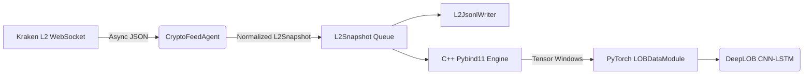

# Microstructure


Microstructure is an institutional-grade Limit Order Book (LOB) research pipeline built for modeling high-frequency price dynamics. Featuring a robust polyglot architecture, the system leverages a C++ (`pybind11`) integration to process 10-level deep asynchronous Kraken WebSocket feeds. This high-performance engine feeds a PyTorch Lightning DeepLOB (CNN-LSTM) architecture designed to model short-horizon volume-weighted mid-price returns.

## Production Infrastructure

The ingestion daemon subscribes to Kraken L2 WebSocket `book` streams and maintains local 10-level bid and ask books per symbol. Each normalized `L2Snapshot` is written as append-only JSONL so training jobs can consume deterministic, replayable records without depending on a running exchange connection.

### Polyglot Pipeline Architecture



The containerized daemon is designed for long-running collection. Docker owns the runtime environment, `.env` controls symbols and persistence settings, and mounted volumes retain distributed snapshot shards under `data/l2`.

## Rigorous Research Methodology

Market microstructure data is noisy, asynchronous, and frequently incomplete. The pipeline handles this by sorting snapshots by symbol, timestamp, and sequence; padding missing book levels with neutral values; transforming price levels relative to the current volume-weighted mid; and preserving raw event order for offline audits. 

Research code must avoid look-ahead bias. Normalization for experiments uses backward-looking rolling windows only, and validation rigorously employs Purged K-Fold or Walk-Forward splits rather than random train/test splits.

### Target Formulation

Tensor creation flows through the PyTorch Lightning `LOBDataModule`, which builds rolling LOB windows and calculates the prediction target. The target represents the volume-weighted mid-price return over the next $k$ ticks:

$$ y_{t,k} = \frac{VWAP_{t+k}}{VWAP_{t}} - 1 $$

## C++ Acceleration Layer

The research DataModule delegates CPU-bound LOB preprocessing to a required C++17/pybind11 extension. This architectural decision was critical to bypass the Python GIL and ensure that high-frequency tick reconstruction—which includes building relative price/volume features, applying backward-looking rolling normalization, and constructing per-symbol rolling windows—does not bottleneck the deep learning training loop. While the API maintains a stable Python interface (`LOBDataModule`), the computational heavy-lifting remains strictly in C++.

### Local Compilation

Build the extension locally using the provided virtual environment configuration:

```bash
uv venv
source .venv/bin/activate
uv pip install -e ".[dev]"
cmake -S . -B build
cmake --build build
```

## Quick Start

Clone the repository:

```bash
git clone https://github.com/nxd914/microstructure.git
cd microstructure
```

Start the ingestion daemon with Docker:

```bash
cp .env.example .env 2>/dev/null || true
docker compose -f deploy/docker-compose.yml up --build
```

### Environment Settings

| Variable | Default | Description |
|---|---|---|
| `KRAKEN_SYMBOLS` | `BTC,ETH` | Target pairs for websocket ingestion. |
| `KRAKEN_BOOK_DEPTH` | `10` | Order book depth levels to track. |
| `SNAPSHOT_QUEUE_SIZE` | `5000` | Max buffered snapshots. |
| `L2_PERSIST_JSONL` | `true` | Toggle disk writing. |
| `L2_JSONL_OUTPUT_DIR` | `data/l2` | Local storage directory. |

Run the local research and regression suite:

```bash
source .venv/bin/activate
pytest
```

## Repository Layout

```text
microstructure/
├── config/                                # YAML/JSON hyperparameters and env settings
├── core/                                  # Shared runtime utilities
├── deploy/                                # Container and service files
├── docs/                                  # Deep architecture notes & methodology
├── scripts/                               # Execution scripts (e.g., train_model.py, run_backtest.py)
├── strategies/crypto/
│   ├── daemon.py                          # Ingestion daemon entry point
│   ├── agents/                            # Kraken L2 feed agent
│   ├── core/                              # Config, L2 models, JSONL writer, logging
│   └── research/                          # DataModule, targets, DeepLOB model scaffold
└── tests/                                 # Feed, storage, target, data, and model tests
```

## License

Proprietary. All rights reserved.